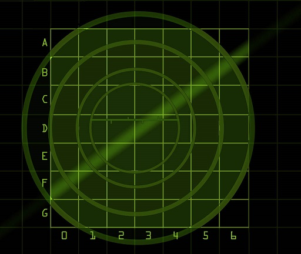

 
<h1> BattleShip Game </h1> <h3><a href= "www.project-battleship-game.com"> www.project-battleship-game.com</a></h3>
<h3> A simple <em>JavaScript</em> based game which will ask you to make guesses and find Ships on the radar system.</h3>
<h3> Rules of the game are as follows- </h3>

- There are a total of 9 ships located somewhere in this grid in groups of 3. The groups can be either horizontal or vertical in direction. Not diagnol.

- Enter your guesses in the box and press "Fire" or press Enter.

- Your job is to find the locations of these ships in the grid with minimum guesses.

- Remember, the ships are in a group of 3. So, if you spot one ship, the rest 2 ships are going to be neighbours of the spotted ship.

- When you find all the 3 fleets of ships, you will win the game. The game will display the stats about your performance based on the number of guesses.

<h3> About Me </h3>

 My name is Archit Rathi and I am a Web Developer. I am a graduate from the University of Ottawa.

 Currently I am doing freelance web development and building up my skills for a job in the field of Web Development.

 This small project is to showcase my skills and knowledge on JavaScript and Front-End Web Development. 

 In case you want to contact me, my email is <em>architrrathi@gmail.com</em>

